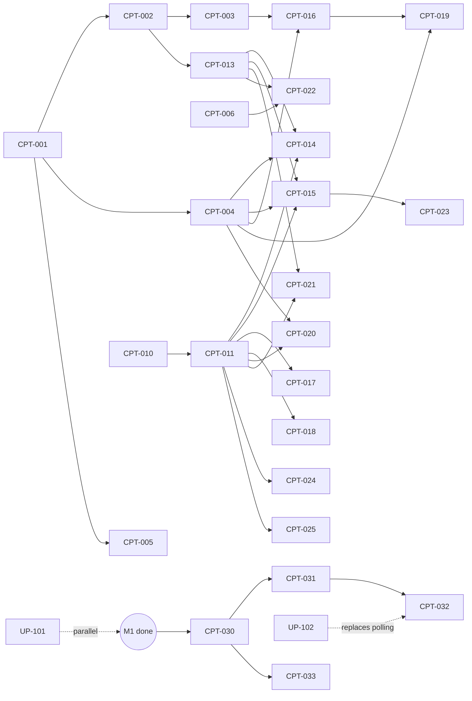

# Iroh Rooms Cockpit — GitHub Backlog

A full project backlog for building the **Iroh Rooms Cockpit**: a visual Pi agent
extension — a dense, live, dark TUI command center for supervising Iroh Rooms
(rooms, members, agents, files, pipes, live activity, diagnostics, alerts, and
command actions) without leaving Pi.

Two repos:

- **`pi-rooms-cockpit`** — new Pi package (issues `CPT-*`)
- **`iroh-room`** — upstream (issues `UP-*`)

Status assumptions (verified against the Developer Preview state of this repo):
`agent invite`, `agent status`, `file fetch`, verified blob serving, the
`error[code]:`/`next:` taxonomy, `--verbose` diagnostics, the full-demo e2e
suites, and the public Rust SDK façade (`crates/iroh-rooms`) have all landed.
Known gaps still open: no `room list --json`, no live all-event
`room tail --json`, no `pipe list --json`, no sync percentage, limited pipe
metrics, Gate A real-NAT measured but still carrying production sign-off
caveats.

---

## 1. Strategy & milestones

| Milestone | Goal | Exit criteria | Depends on | Key risk |
|---|---|---|---|---|
| **M0 — Scaffolding** | A loadable, testable, secure foundation: package skeleton, CLI adapter, process supervisor, parsers | `pi install ./pi-rooms-cockpit` loads; adapter runs `identity show --json` end-to-end; parser fixtures green in CI | — | text-format coupling to the CLI |
| **M1 — v0 CLI-backed Cockpit** | The full visual dashboard + tools, fed entirely by today's CLI | All panels render live data from a real 2-participant room; command bar + LLM tools work; golden render tests green | M0 | live tail renders only `message.text` → poll-diff architecture |
| **M2 — v0.5 Upstream ergonomics** (`iroh-room`) | Remove the scraping workarounds at the source | `room list --json` + NDJSON live tail merged upstream | independent (parallel with M1) | maintainer bandwidth; spec-driven repo process |
| **M3 — v1 SDK companion** | Rust sidecar over `crates/iroh-rooms --features experimental`; extension stops text-scraping | Sidecar streams all event types + peer state as NDJSON; extension runs on either backend behind one interface | M1; informed by M2 | `experimental` tier may change on any release |
| **M4 — Polish & release** | Developer-preview quality: visual polish, docs, demo, honest limitations | Definition of done (§7) fully met | M1 (M3 optional) | scope creep; fake-metric temptation |

**Placement decision (M0):** build as a **distributable Pi package**
(git-installable, `pi` manifest in `package.json`, `extensions/` dir,
`pi-package` keyword), developed with project-local loading
(`pi -e ./extensions/cockpit`). Core Pi libs (`@earendil-works/pi-coding-agent`,
`@earendil-works/pi-tui`, `typebox`) go in `peerDependencies` per Pi's
`docs/packages.md`.

---

## 2. Issue backlog

### A. Summary table

| # | Title | Repo | Type | Milestone | Pri | Size | Depends on |
|---|---|---|---|---|---|---|---|
| CPT-001 | Pi package scaffolding & placement | cockpit | infra | M0 | P0 | M | — |
| CPT-002 | CLI adapter: binary/home resolution + coded-error decoding | cockpit | feature | M0 | P0 | M | CPT-001 |
| CPT-003 | Managed child-process supervisor | cockpit | feature | M0 | P0 | M | CPT-002 |
| CPT-004 | Pinned-format parser library + fixture corpus | cockpit | feature/test | M0 | P0 | L | CPT-001 |
| CPT-005 | CI & test harness | cockpit | infra | M0 | P0 | S | CPT-001 |
| CPT-006 | Security & trust posture: secret redaction rules | cockpit | design/docs | M0 | P0 | S | — |
| CPT-010 | UX spec + ASCII mockups for all panels | cockpit | design | M1 | P0 | S | — |
| CPT-011 | Dashboard shell: layout engine + keyboard nav | cockpit | feature | M1 | P0 | L | CPT-010 |
| CPT-012 | Cockpit visual language & theme mapping | cockpit | design | M1 | P1 | M | CPT-010, CPT-011 |
| CPT-013 | State model & room registry | cockpit | feature | M1 | P0 | M | CPT-002 |
| CPT-014 | Members & Agents panel | cockpit | feature | M1 | P0 | M | CPT-004, CPT-011, CPT-013 |
| CPT-015 | Live Activity feed (offline-JSON diff engine) | cockpit | feature | M1 | P0 | M | CPT-004, CPT-011, CPT-013 |
| CPT-016 | Session presence: managed `room tail` | cockpit | feature | M1 | P0 | M | CPT-003, CPT-004 |
| CPT-017 | Files panel: list / share / fetch | cockpit | feature | M1 | P0 | M | CPT-004, CPT-011 |
| CPT-018 | Pipes panel + audit feed | cockpit | feature | M1 | P1 | M | CPT-003, CPT-011 |
| CPT-019 | Network/Availability panel (`diag:` parsing) | cockpit | feature | M1 | P1 | S | CPT-004, CPT-016 |
| CPT-020 | Alerts panel (coded errors/warnings/next-actions) | cockpit | feature | M1 | P1 | M | CPT-004, CPT-011 |
| CPT-021 | Command bar + invite-ticket dialog | cockpit | feature | M1 | P0 | M | CPT-011, CPT-013 |
| CPT-022 | LLM tools suite | cockpit | feature | M1 | P0 | L | CPT-002, CPT-013 |
| CPT-023 | Ambient mode: footer pill + mini-feed widget | cockpit | feature | M1 | P1 | S | CPT-015, CPT-016 |
| CPT-024 | Responsive / narrow-terminal behavior | cockpit | design | M1 | P1 | M | CPT-011 |
| CPT-025 | Golden render tests for panels | cockpit | test | M1 | P1 | M | CPT-011..020 |
| UP-101 | `room list --json` | iroh-room | feature | M2 | P0 | S | — |
| UP-102 | Live `room tail --json` (NDJSON, all event types) | iroh-room | feature | M2 | P0 | M | — |
| UP-103 | Close live-tail display gap (text mode, all event types) | iroh-room | feature | M2 | P1 | S | — |
| UP-104 | `pipe list --json` | iroh-room | feature | M2 | P1 | S | — |
| UP-105 | Structured diagnostics (`--json` diag block) | iroh-room | feature | M2 | P2 | S | — |
| UP-106 | Runtime counters (pipe bytes, fetch progress, sync/backfill stats) | iroh-room | feature | M2 | P3 | M | UP-105 |
| CPT-030 | ADR: sidecar protocol & lifecycle | cockpit | design | M3 | P0 | S | M1 done |
| CPT-031 | `cockpit-sidecar` Rust crate skeleton | cockpit | feature | M3 | P0 | L | CPT-030 |
| CPT-032 | Live streams via sidecar (events, peers, agents) | cockpit | feature | M3 | P0 | L | CPT-031 |
| CPT-033 | Backend abstraction: CLI vs sidecar | cockpit | refactor | M3 | P0 | M | CPT-030 |
| CPT-034 | Sidecar build & distribution story | cockpit | infra | M3 | P1 | M | CPT-031 |
| CPT-040 | Visual polish + performance pass | cockpit | design | M4 | P1 | M | M1 done |
| CPT-041 | README, setup guide, demo script, recordings | cockpit | docs | M4 | P0 | M | M1 done |
| CPT-043 | Release-readiness checklist + known limitations | cockpit | docs | M4 | P0 | S | CPT-041 |

34 issues.

### B. Full specs — M0, M1, and P0 issues elsewhere

---

#### CPT-001 — Pi package scaffolding & placement

`infra` · labels: `infra`, `m0` · M0 · P0 · M · Depends: —

**Problem:** No project exists; Pi packages have a specific manifest/layout
contract and a placement decision (global vs project vs distributable package)
must be made once, correctly.

**Solution:** New repo `pi-rooms-cockpit` with `package.json`
(`"pi": { "extensions": ["./extensions"] }`, `pi-package` keyword, core Pi libs
as `peerDependencies` with `"*"`), `extensions/cockpit/index.ts` entry exporting
the default factory, TypeScript strict config, `src/` for shared modules.

**AC:**
- `pi -e ./extensions/cockpit` loads without error and registers a `/cockpit` stub command
- `pi install ./` from a sibling checkout also loads it
- no core Pi lib is bundled

**Tests:** load-smoke script in CI (extension factory imports and returns).

**Notes:** follow Pi `docs/packages.md` conventions; no background resources in
the factory (deferred to `session_start` per Pi `docs/extensions.md`).

---

#### CPT-002 — CLI adapter: binary/home resolution + coded-error decoding

`feature` · `core`, `m0` · M0 · P0 · M · Depends: CPT-001

**Problem:** Every feature shells out to `iroh-rooms`; binary location, data-dir
resolution, and failure semantics must be centralized or they'll be
reimplemented per panel.

**Solution:** `src/cli.ts`: locate binary (setting > `$PATH` >
`target/release/iroh-rooms` in a configured checkout); pass
`--data-dir`/`IROH_ROOMS_HOME` from extension settings; `run()` wrapper
returning `{ stdout, stderr, code, coded }` where `coded` parses
`error[<code>]:` + `next:` lines and maps exit categories 1–6 (per the
`README.md` error-taxonomy table).

**AC:**
- `identity show --json` round-trips
- a forced `invalid_room_id` failure yields `{ code: "invalid_room_id", exit: 2, next: "copy the room id…" }`
- unknown/uncoded errors degrade to `{ code: "internal" }`
- secrets (`roomtkt1…`) never logged

**Tests:** unit tests with faked exec responses covering each exit category;
redaction test asserting ticket tokens are masked in any thrown error.

**Notes:** register a `cockpit.binary` / `cockpit.home` settings surface + a
`/cockpit-setup` command.

---

#### CPT-003 — Managed child-process supervisor

`feature` · `core`, `m0` · M0 · P0 · M · Depends: CPT-002

**Problem:** The cockpit runs long-lived children (`room tail`, `pipe expose`,
later the sidecar). Orphaned processes hold the blob-store lock and leave pipes
open on the log (SIGKILL caveat in `RELEASE-READINESS.md`).

**Solution:** `src/supervisor.ts`: named handles, spawn-on-demand (never in the
factory), line-buffered stdout/stderr subscriptions, graceful
`SIGINT`→`SIGTERM`→timeout kill, idempotent `session_shutdown` cleanup,
restart-with-backoff policy, single-instance guard per (command, room).

**AC:**
- starting `room tail` twice for one room reuses the handle
- `session_shutdown` and `/reload` leave zero orphans (verified via process table in test)
- a crashed child is surfaced as an Alert event, not silently restarted forever (max 3 backoff retries)

**Tests:** integration test with a fake long-running script; kill-ordering and
cleanup assertions.

**Notes:** SIGTERM matters — `pipe expose` emits `pipe.closed{owner_exit}` on
SIGTERM but not SIGKILL.

---

#### CPT-004 — Pinned-format parser library + fixture corpus

`feature/test` · `core`, `m0` · M0 · P0 · L · Depends: CPT-001

**Problem:** v0 consumes half a dozen pinned CLI grammars; parsing scattered
across panels would be untestable and fragile.

**Solution:** `src/parsers/` with one module + fixture set per surface:

1. `room tail --offline --json` rows incl. `agent.status` fields `state/message/progress/artifacts`
2. `room members --json`
3. `file list --json` incl. `provider: unknown`
4. live-tail lines: `listening:`, `[ts] author: body`, `peer … state=… [reason=…]`, `peers: N connected…`
5. `diag:` lines (local/peer/transport)
6. `error[code]:` / `warning[code]:` / `next:`
7. audit vocab `pipe.*`, `reject.*`, `blob.serve.*`, `join.bootstrap.*`
8. `pipe list` text blocks
9. labeled outputs (`room create`, `invite` ticket line, `file share`, `agent status` summary)

**AC:**
- every parser is total (never throws on unknown lines — returns `{ kind: "unknown" }`)
- fixtures captured from the real binary and checked in
- parser version notes the CLI commit they were captured against

**Tests:** fixture-driven unit tests per grammar; a "drift" test doc explaining
how to re-capture fixtures.

**Notes:** this module is the #1 breakage surface — see Risk register R1.

---

#### CPT-005 — CI & test harness

`infra` · `m0` · M0 · P0 · S · Depends: CPT-001

**Problem:** TUI + subprocess code rots instantly without CI.

**Solution:** GitHub Actions: typecheck, lint, unit tests (node test runner or
vitest), the load-smoke from CPT-001. Optional job (manual trigger) that builds
`iroh-room` and re-validates parser fixtures against the real binary.

**AC:** PRs blocked on green; fixture-revalidation job documented.

**Tests:** the harness is the test.

---

#### CPT-006 — Security & trust posture: secret redaction rules

`design/docs` · `security`, `m0` · M0 · P0 · S · Depends: —

**Problem:** Invite tickets are password-grade capabilities; Pi extensions can
leak them three ways: session entries, LLM context (tool results), and logs.

**Solution:** A short `SECURITY.md` + enforced conventions: tickets rendered
only in an ephemeral dialog (never `appendEntry`, never tool-result `content`,
masked in `details`); `identity.secret`/`rooms.db` never read directly in v0;
all tool results pass a redaction filter
(`roomtkt1[a-z2-7]+` → `roomtkt1…<masked>`); pipe-expose warnings preserved
verbatim in UI.

**AC:**
- redaction filter exists with tests
- grep-able rule: no module besides the invite dialog touches raw ticket text
- `SECURITY.md` states the posture incl. "extension never opens the blob store or SQLite directly"

**Tests:** unit tests feeding tickets through every tool-result path and
asserting masking.

---

#### CPT-010 — UX spec + ASCII mockups for all panels

`design` · `design`, `m1` · M1 · P0 · S · Depends: —

**Problem:** Panels built without a shared spec will drift in density,
alignment, and interaction grammar.

**Solution:** `docs/ux-spec.md` with: full-width mockup (below), ≥80-col and
≤60-col degradations, per-panel column specs, tag color table, keyboard map
(`d/r/m/p/f/e` panels, `:` command bar, `j/k` row nav, `enter` detail, `esc`
quit), honesty rules (no fake metrics; `unauthorized` ≠ `offline`).

```text
┌ IROH ROOMS COCKPIT ─ ◉ SERVING ─ PEERS 2/3 ─ PIPES 1 ─ FILES 4 ─ EVENTS 412 ─ 14:32:07 ┐
│ NAV        ││ MEMBERS & AGENTS      room: build-mvp ││ AGENT STATUS                      │
│ ▸ Dash [d] ││ alice(you) admin  active  self        ││ pi-agent  ▶ running_tests    40%  │
│   Room [r] ││ bob        member active  ● connected ││   "Running integration tests"     │
│   Membr[m] ││ pi-agent   agent  active  ● connected ││   artifacts: file_9m1p…  2m ago   │
│   Pipes[p] │├───────────────────────────────────────┤├───────────────────────────────────┤
│   Files[f] ││ LIVE ACTIVITY              ● polling  ││ FILES                    4 shared │
│   Evnts[e] ││ 14:31:45 MSG   bob: "preview ready?"  ││ qa-report.pdf 1.2M ✓you (local)   │
│            ││ 14:31:32 AGENT running_tests 40%      ││ prd_v0.3.md   2.4K ◌ ref-only     │
│ WORKSPACE  ││ 14:31:18 FILE  qa-report.pdf shared   ││ [s]hare [g]et [enter] detail      │
│ alice      ││ 14:31:05 PEER  bob ● connected        │├───────────────────────────────────┤
│ id 12d3…a8 ││ 14:30:58 JOIN  pi-agent → active      ││ NETWORK          direct 1 relay 1 │
│ dev 9f2c…c4││ 14:30:12 PIPE  dev-preview opened     ││ ALERTS (2)                        │
│            ││ 14:29:41 ROOM  created build-mvp      ││ ⚠ reject.bad_signature 1  9m      │
│ esc → Pi   ││                                       ││ ⚠ peer bob offline: link_drop 12m │
└────────────┴┴───────────────────────────────────────┴┴───────────────────────────────────┘
 :send …  :invite …  :agent status …  :pipe expose …  :fetch …          [?] help  [q] quit
```

**AC:** spec covers all 8 panels + command bar + ambient mode;
reviewed/approved before CPT-011 merges.

**Tests:** n/a (design doc).

---

#### CPT-011 — Dashboard shell: layout engine + keyboard nav

`feature` · `tui`, `m1` · M1 · P0 · L · Depends: CPT-010

**Problem:** Pi's TUI gives `render(width): string[]` and raw key input; the
cockpit needs a multi-panel grid, focus model, and render loop on top.

**Solution:** `src/tui/shell.ts`: a `CockpitShell` component (opened via
`ctx.ui.custom()`, closed with `q`/`esc`) composing `Panel` children in a
column grid; panel registry keyed by nav letters; focus ring;
`tui.requestRender()` on every state tick; strict `truncateToWidth` on all
lines; `invalidate()` rebuilds themed content (theme-change rule from Pi
`docs/tui.md`).

**AC:**
- `/cockpit` opens full-screen; `d/r/m/p/f/e` switch focus; `esc` restores the editor cleanly
- no rendered line ever exceeds width (property-tested)
- shell renders with all panels showing "no data" placeholders

**Tests:** golden render at 120/100/80 cols with placeholder data;
width-overflow property test.

**Notes:** pattern references: Pi examples `snake.ts` (input loop),
`overlay-qa-tests.ts` (dimensions).

---

#### CPT-012 — Cockpit visual language & theme mapping

`design` · `design`, `tui`, `m1` · M1 · P1 · M · Depends: CPT-010, CPT-011

**Problem:** The reference aesthetic (dense dark command center, colored tags,
status dots) must map to Pi theme roles so it survives theme switching.

**Solution:** `src/tui/style.ts`: single mapping table — tags (`MSG`=text,
`FILE`=accent, `PIPE`=warning, `AGENT`=success, `PEER`/`SYNC`=muted,
`ROOM`=accent-bold), status dots (`●` success / `◌` dim / `⚠` warning / `✗`
error), progress bars (`▰▰▰▱▱`), header pills. No hardcoded ANSI.

**AC:**
- all panels consume only `style.ts`
- switching Pi theme live re-renders correctly (invalidate path)
- contrast sanity-checked on dark + light built-in themes

**Tests:** snapshot per theme for one representative panel.

---

#### CPT-013 — State model & room registry

`feature` · `core`, `m1` · M1 · P0 · M · Depends: CPT-002

**Problem:** No `room list` upstream; the cockpit must track known rooms, the
active room, and per-room caches, surviving restarts.

**Solution:** `src/state.ts`: store snapshot in
`pi.appendEntry("cockpit-state", …)`, rebuild on `session_start`; room registry
populated from user input (`:room use <id>`), from `room create`/`join` outputs
the cockpit itself ran, and validated via `room members --json`; per-room cache
holds last-seen `event_id` set, roster, files, pipes, alerts ring.

**AC:**
- active room persists across `/reload` and session resume
- unknown-room selection shows the CLI's coded `room_not_found` + next-action
- registry capped and LRU-ordered

**Tests:** state rebuild-from-entries unit tests; branch/fork safety (state
stored via entries, not globals).

---

#### CPT-014 — Members & Agents panel

`feature` · `panel`, `m1` · M1 · P0 · M · Depends: CPT-004, CPT-011, CPT-013

**Problem:** The roster is the room's who/what/health view; agents deserve
first-class display now that `agent status` exists.

**Solution:** Poll `room members --json` (5s); join `role=agent` rows with the
latest `agent.status` per sender from the activity engine (CPT-015): state
label, progress bar, message, artifact handles, age. Conn column fed by the
live tail peer lines (CPT-016) when a session runs, else
`room members --status` on demand (`c` key). Display statuses:
`active/invited/removed/left`; honesty rule: `unauthorized` never shown as
offline.

**AC:**
- roster matches CLI output byte-for-byte in meaning
- agent row shows state+progress+artifacts from a real `agent status` post
- conn column shows `self`, `● connected`, `offline reason=…`, `unauthorized`, `n/a`

**Tests:** golden renders from fixtures: fresh room, 3-member room with agent,
room with removed+left members.

---

#### CPT-015 — Live Activity feed (offline-JSON diff engine)

`feature` · `panel`, `core`, `m1` · M1 · P0 · M · Depends: CPT-004, CPT-011, CPT-013

**Problem:** Live `room tail` streams only `message.text`
(`RELEASE-READINESS.md` known limitation), so a complete live feed must be
synthesized.

**Solution:** `src/feeds/activity.ts`: poll
`room tail --offline --json --limit N` (2s while cockpit open, 10s ambient);
diff by `event_id` against the per-room seen-set; emit typed feed items for all
event types (`room.created`, `member.*`, `message.text`, `file.shared`,
`pipe.*`, `agent.status`); tag + one-line summary per type; ring buffer (500).
This engine is also the data source for CPT-014's agent join and CPT-023's
mini-feed. Backend interface designed so M3's sidecar stream can replace
polling (same item type).

**AC:**
- a message sent from a second terminal appears ≤2s later
- `agent status --progress 40` appears as `AGENT running_tests 40%`
- restart of the cockpit doesn't replay old events as new (seen-set persisted)
- poll pauses when no cockpit UI and no ambient widget is active

**Tests:** diff-engine unit tests (dedupe, ordering by `(lamport, event_id)`,
ring eviction); fixture feeds.

---

#### CPT-016 — Session presence: managed `room tail`

`feature` · `core`, `m1` · M1 · P0 · M · Depends: CPT-003, CPT-004

**Problem:** A running `room tail` is what makes this node *present*: it
receives events, serves blobs, hosts joins, and emits peer/diag/audit lines the
panels need.

**Solution:** `:session start [--accept-joins] [-v]` spawns
`room tail <room> [-v]` via the supervisor; parse `listening:` (shown as
copyable pill), peer transition lines → conn states, roster summaries,
`warning[code]` rejects, `diag:` lines (with `-v`), `blob.serve.*` audit.
Surface join-window state (`--accept-joins`) as an explicit header badge with
the privacy trade-off in its detail view.

**AC:**
- starting/stopping the session flips header `◉ SERVING`/`○ OFFLINE`
- peer transitions update Members conn column live
- the blob-lock interaction is handled — `file list` provider shows `unknown` while the session holds the store lock (expected, rendered honestly)
- shutdown kills the child cleanly

**Tests:** supervisor+parser integration test with scripted fake tail output;
blob-lock scenario fixture.

---

#### CPT-017 — Files panel: list / share / fetch

`feature` · `panel`, `m1` · M1 · P0 · M · Depends: CPT-004, CPT-011

**Problem:** The verified-artifact loop (share → serve → fetch → verify) is now
complete upstream and is a core demo moment.

**Solution:** Poll `file list --json` (10s); rows: name, size, hash prefix,
provider (`you (local)` / `reference-only` / `unknown` with lock explanation).
Actions: `s` share (path prompt → `file share`), `g` fetch (`file fetch`,
spinner via BorderedLoader, result `saved:/verified:/size:` shown in detail);
failures branch on `blob_unavailable` / `peer_unauthorized` / `hash_mismatch` /
`not_a_member` with the CLI's `next:` line rendered as the call-to-action.
`hash_mismatch` renders as a red integrity alert, never a retry suggestion.

**AC:**
- full share→fetch loop works between two homes on one machine (provider running `room tail`)
- each coded failure renders its distinct state
- fetched file path is copyable

**Tests:** golden renders per provider state; coded-failure unit tests from
fixtures.

---

#### CPT-018 — Pipes panel + audit feed

`feature` · `panel`, `m1` · M1 · P1 · M · Depends: CPT-003, CPT-011

**Problem:** Live Pipe is the product's differentiator; the cockpit should make
expose/connect/close and their audit trail visible — within what the CLI
exposes (no traffic rates).

**Solution:** Poll `pipe list` (text parser, 10s): pipe id, owner, label,
allowed count, expiry. Actions: `:pipe expose` (target + `--allow` member
picker from roster + label/expiry; §13.2.4 warning shown verbatim before
spawn), `:pipe connect`, `:pipe close`. Cockpit-spawned expose/connect children
stream `pipe.connect.accepted/rejected:<cause>` / `pipe.torndown:<cause>` into
the panel + Alerts. No invented traffic columns — show session state + audit
counts only.

**AC:**
- expose→connect→bytes-through→close works on loopback
- an unauthorized connect renders `rejected:not_allowed` within one poll
- SIGTERM close emits and displays `pipe.closed{owner_exit}`

**Tests:** parser fixtures; supervisor integration with scripted audit lines.

---

#### CPT-019 — Network/Availability panel

`feature` · `panel`, `m1` · M1 · P1 · S · Depends: CPT-004, CPT-016

**Problem:** "Sync %" and traffic sparklines don't exist upstream; the honest
equivalent is path classification + peer availability.

**Solution:** Render from `diag:` lines (verbose session) + roster summaries:
local endpoint id + relay URL, per-peer `direct/relay/mixed/none`, aggregate
counts, last-event age, total event count. Explicit production-connectivity
footnote when not on loopback, pointing to the measured Gate A caveats instead
of inferring guarantees from a single live path.

**AC:**
- matches `diag:` fixture data exactly
- degrades to "start session with -v for path detail" when non-verbose

**Tests:** golden render from diag fixtures.

---

#### CPT-020 — Alerts panel

`feature` · `panel`, `m1` · M1 · P1 · M · Depends: CPT-004, CPT-011

**Problem:** The repo now has a stable, script-branchable failure vocabulary;
the cockpit should turn it into a prioritized, actionable queue instead of
scattered stderr.

**Solution:** `src/feeds/alerts.ts`: aggregate `error[code]`+`next:` from any
cockpit-run command, `warning[code]` (incl. `clock_skew`, `reject.*` from live
tail), pipe audit rejects, `peer.deauthorized`/`peer.offline:<reason>`,
pending-invite expiries (derived from `member.invited.expires_at` in the
activity feed). Severity: integrity (red) > auth (yellow) > connectivity
(blue) > advisory (dim). Each alert shows its `next:` action; `enter` copies
the suggested command into the command bar.

**AC:**
- a `hash_mismatch` fetch produces a red alert with the "do not trust this file" text
- alert ring persists per room across cockpit reopen
- dismissal supported

**Tests:** severity-mapping unit tests; golden render with mixed alert set.

---

#### CPT-021 — Command bar + invite-ticket dialog

`feature` · `tui`, `m1` · M1 · P0 · M · Depends: CPT-011, CPT-013

**Problem:** Acting from the cockpit (send, invite, agent status, share,
expose) must not require leaving to a shell; tickets need special secret
handling.

**Solution:** `:` opens an input row with verb autocomplete (`room use/create`,
`send`, `invite`, `agent invite/status`, `file share/fetch`,
`pipe expose/connect/close`, `session start/stop`, `join`); each verb maps to a
CLI invocation via CPT-002 with output routed to the relevant panel.
`invite`/`agent invite` results open a **modal ticket dialog**: masked by
default, `r` reveals, `c` copies, password-grade warning verbatim; ticket never
persisted or logged (CPT-006).

**AC:**
- every verb round-trips against the real binary
- ticket dialog enforces mask/copy/warning
- malformed args surface clap/coded errors inline

**Tests:** verb→argv mapping unit tests; redaction test on the dialog path.

---

#### CPT-022 — LLM tools suite

`feature` · `tools`, `m1` · M1 · P0 · L · Depends: CPT-002, CPT-013

**Problem:** The cockpit's second half: Pi's agent should *act* in the room
(JTBD-1 — Pi is the room's agent).

**Solution:** `pi.registerTool` for: `room_status` (roster+conn+recent activity
digest), `room_send`, `room_tail_recent` (last N events, truncated),
`agent_status` (state/message/progress/artifacts), `agent_invite`,
`file_share`, `file_fetch`, `file_list`, `pipe_list`, `pipe_expose` (requires
explicit `allow` identities — never default-all). Each: TypeBox schemas
(StringEnum where needed), `promptSnippet` + self-naming `promptGuidelines`,
output truncation (`truncateHead`, 50KB/2000-line rule), state in `details` for
branch-safety, ticket redaction (CPT-006), custom `renderCall`/`renderResult`
using CPT-012 styles.

**AC:**
- an end-to-end scripted conversation: Pi checks status → sends a message → posts `agent_status` with progress → shares a file — all visible live in the cockpit
- every result ≤ truncation caps
- no secret in any tool result

**Tests:** per-tool unit tests with faked CLI; guideline lint (each guideline
names its tool).

---

#### CPT-023 — Ambient mode: footer pill + mini-feed widget

`feature` · `tui`, `m1` · M1 · P1 · S · Depends: CPT-015, CPT-016

**Problem:** The room should stay visible while using Pi normally — that's
what makes it feel alive.

**Solution:** `ctx.ui.setStatus("cockpit", "◉ build-mvp 2/3 ▮1 ⚠2")` refreshed
on feed ticks; optional 3-line `setWidget` mini-feed (latest tagged events)
toggled by `/cockpit-ambient`; both cleared on session shutdown.

**AC:**
- pill updates on peer transitions and new events
- widget toggles
- zero flicker during streaming (no `requestRender` storms — throttle 500ms)

**Tests:** throttle unit test; render snapshot of the widget.

---

#### CPT-024 — Responsive / narrow-terminal behavior

`design` · `design`, `tui`, `m1` · M1 · P1 · M · Depends: CPT-011

**Problem:** The 3-column cockpit collapses badly under 100 cols without
explicit breakpoints.

**Solution:** Breakpoints in the shell: ≥110 three columns; 80–109 two columns
(nav collapses to a one-line tab bar); <80 single stacked panel with
`d/r/m/p/f/e` switching full-screen panels; all column specs from CPT-010
define per-breakpoint truncation priorities (ids shorten first, names last).

**AC:** golden renders at 120/100/80/60 cols with real fixture data, no
overflow, no unreadable panels.

**Tests:** the four golden widths in CI.

---

#### CPT-025 — Golden render tests for panels

`test` · `test`, `m1` · M1 · P1 · M · Depends: CPT-011..020

**Problem:** TUI regressions are invisible in unit tests; goldens make visual
drift reviewable in diffs.

**Solution:** Harness rendering each panel (and full shell) at fixed widths
with the CPT-004 fixture corpus, ANSI stripped + a second colored variant,
committed as `.golden` files with an update script.

**AC:** all panels covered; intentional visual changes require regenerating
goldens in the same PR.

**Tests:** the harness itself.

---

#### UP-101 — `iroh-rooms room list --json` (upstream)

`feature` · `cli` · M2 · P0 · S · Depends: —

**Problem:** Rooms are discoverable internally (`EventStore::room_ids()`,
already used by `pipe close` inference —
`crates/iroh-rooms-core/src/store/mod.rs:206`) but there is no user-facing
enumeration; every consumer must ask users to paste room ids.

**Solution:** `RoomAction::List { json: bool }`: offline read; for each
`room_ids()` entry, fold-derive name (`room.created.room_name`), member/active
counts, last-event `(lamport, at)`. Text mode: labeled lines matching house
style; `--json`: stable array
`[{room_id, name, members, active, last_event_at}]`.

**AC:**
- empty store → `(no rooms)` / `[]`, exit 0
- deterministic order (ascending room id)
- no network, no identity load, no membership requirement (same posture as `room tail --offline`)
- output reconciled into `docs/getting-started.md`

**Tests:** CLI integration tests (0/1/3 rooms, JSON contract, restart
determinism) mirroring `tail_cli.rs` conventions.

**Notes:** purely additive; spec should follow the repo's `specs/` + issue
conventions.

---

#### UP-102 — Live `room tail --json` NDJSON stream (upstream)

`feature` · `cli` · M2 · P0 · M · Depends: —

**Problem:** The live session renders only `message.text`
(`crates/iroh-rooms-cli/src/message.rs:1009`; known limitation in
`RELEASE-READINESS.md`); tooling must poll the offline read to see joins,
files, pipes, and agent statuses — wasteful and laggy.

**Solution:** Allow `--json` with the online session: emit one NDJSON object
per newly-validated event using the **same row schema as the offline
`TailRow`** (reuse `content_fields`), plus typed non-event records
`{kind:"listening"|"peer"|"roster"|"warning"}` for the session lines. stdout =
NDJSON only; human text moves to stderr in this mode.

**AC:**
- schema-identical to offline rows for shared fields
- all event types stream
- peer transitions stream as structured records
- existing text mode byte-identical when `--json` absent
- documented in getting-started

**Tests:** two-node loopback e2e asserting an `agent.status` and `file.shared`
arrive as NDJSON live; schema-equality test offline-vs-live for the same event.

**Notes:** UP-103 (render all types in *text* mode) is the smaller cosmetic
alternative if NDJSON is contentious; both close the display gap.

---

#### CPT-030 — ADR: sidecar protocol & lifecycle

`design` · `adr`, `m3` · M3 · P0 · S · Depends: M1

**Problem:** Moving off text-scraping needs a deliberate contract: transport,
message schema, versioning, and failure semantics — before Rust code exists.

**Solution:** ADR covering: NDJSON over stdio (chosen over socket for
supervisor reuse and zero ports); request/response + subscription frames
(`{v, id, op, …}`); ops: `rooms.list`, `room.snapshot`, `room.subscribe`
(events+peers), `agent.status.post`, `file.list/share/fetch`, `pipe.list`;
version handshake frame pinning the `iroh-rooms` crate version; crash/restart
semantics (extension resubscribes, seen-set dedupes); secret rules (tickets
never cross the pipe).

**AC:** ADR reviewed; schema stubs checked in as TypeScript types + Rust
structs kept in one `.md`/schema source.

**Tests:** n/a.

---

#### CPT-031 — `cockpit-sidecar` Rust crate skeleton

`feature` · `sidecar`, `m3` · M3 · P0 · L · Depends: CPT-030

**Problem:** The offline half of the sidecar: room enumeration and snapshots
without shelling to the CLI.

**Solution:** New `sidecar/` crate depending on
`iroh-rooms = { features = ["experimental"] }`; implements `rooms.list` (via
store `room_ids` + fold), `room.snapshot` (roster, files, pipes, recent tail
rows) over stdio NDJSON; respects `IROH_ROOMS_HOME`; never opens the blob store
when a lock is held (mirror the CLI's bounded-wait honesty).

**AC:**
- parity test: `rooms.list`/`room.snapshot` agree with `room members --json` + `room tail --offline --json` on the same home
- graceful `--version` handshake
- builds with the workspace toolchain (`rust-version 1.80`)

**Tests:** Rust integration tests against a fixture home; TS-side decode tests.

**Notes:** deliberately read-only in this issue; online ops land in CPT-032.

---

#### CPT-032 — Live streams via sidecar

`feature` · `sidecar`, `m3` · M3 · P0 · L · Depends: CPT-031

**Problem:** The polling architecture (CPT-015) is the v0 compromise; the
sidecar can hold a real `Node` and stream everything.

**Solution:** `room.subscribe`: spawn `Node::spawn_room` (managed session
semantics: admission cell, peer manager, optional blob serving), poll
`node.room_tail`/`node.conn_events()` internally, push NDJSON frames for all
event types + peer transitions + audit; expose `agent.status.post` and
`file.fetch` as ops with structured outcomes (`FetchOutcome` mapped 1:1).

**AC:**
- cockpit shows an `agent.status` live ≤500ms after a second node posts it (loopback)
- peer transitions stream without the CLI session
- only one of {sidecar session, CLI `room tail`} may hold the home at once — enforced and surfaced in UI

**Tests:** two-home loopback e2e (sidecar + real CLI peer); crash-resubscribe
test.

**Notes:** biggest risk: `experimental` API churn — pin the crate rev; see Risk
R6.

---

#### CPT-033 — Backend abstraction: CLI vs sidecar

`refactor` · `core`, `m3` · M3 · P0 · M · Depends: CPT-030

**Problem:** Panels must not know their data source, or M3 becomes a rewrite.

**Solution:** `src/backend.ts` interface (`listRooms`, `snapshot`, `subscribe`,
`send`, `agentStatus`, `share`, `fetch`, `pipes`…) with `CliBackend` (M0/M1
modules) and `SidecarBackend` (M3); selection by setting + auto-fallback to CLI
when the sidecar binary is missing; feed items and error codes normalized to
one shape.

**AC:**
- all panels/tools compile against the interface only
- toggling backends at runtime keeps state
- fallback path logs one clear notice

**Tests:** contract test suite run against both backends (CLI mocked, sidecar
real).

**Notes:** land the *interface* extraction late in M1 to keep M1 honest but M3
cheap.

---

#### CPT-041 — README, setup guide, demo script, recordings

`docs` · `docs`, `m4` · M4 · P0 · M · Depends: M1

**Problem:** A visual extension without a 5-minute story doesn't get adopted.

**Solution:** README (install via `pi install git:…`, binary/home config,
screenshots); `docs/demo.md`: a scripted two-terminal walkthrough mirroring
`docs/getting-started.md`'s cast (Alice + Pi-as-agent): create → invite → join
→ cockpit open → send → agent status with progress → file share/fetch → pipe
expose/connect → alert on unauthorized connect; capture stills/asciinema for
the package gallery (`pi.image`/`pi.video` fields).

**AC:**
- a fresh user completes the demo from README alone
- gallery metadata present
- every screenshot reproducible from the demo script

**Tests:** docs lint; demo dry-run checklist.

---

#### CPT-043 — Release-readiness checklist + known limitations

`docs` · `docs`, `m4` · M4 · P0 · S · Depends: CPT-041

**Problem:** The upstream repo ships honest (`RELEASE-READINESS.md`); the
cockpit should meet the same bar.

**Solution:** `RELEASE.md`: P0 test list (parsers, goldens, supervisor cleanup,
tool redaction), demo verification pass, and verbatim known limitations:
polling latency vs true streaming (until M3/UP-102), no traffic/sync metrics
(upstream), Gate A measured with sign-off caveats (upstream), blob-lock
`unknown` provider state, live-tail gap workaround, `experimental` SDK caveat
for the sidecar.

**AC:**
- checklist exists and is filled for the first tagged preview
- every limitation links its tracking issue

**Tests:** n/a.

---

## 3. Visual backlog coverage

Covered by dedicated issues: layout (CPT-010/011), theme/density (CPT-012),
responsiveness (CPT-024), keyboard nav (CPT-011), command palette (CPT-021),
feed styling (CPT-015), agent visualization (CPT-014), alerts/diagnostics
presentation (CPT-019/020), mockups (CPT-010), polish (CPT-040).

**Honesty constraints baked in:** no sync %, no traffic rates, no CPU —
replaced by path classification, availability counts, event ages (CPT-019),
pending UP-105/UP-106.

## 4. Sequencing

**Smallest useful vertical slice** (~1 week): CPT-001 → CPT-002 → CPT-004
(offline-tail + members parsers only) → CPT-013 → CPT-011 (shell with 2
panels) → CPT-014 + CPT-015. That already gives a live-feeling room dashboard.

**Order:** M0 serially (001 → 002/004/006 parallel → 003/005) → M1 in three
waves: wave 1 = 010, 013; wave 2 = 011 + 014/015/016 (parallel); wave 3 =
017–025 (parallel) with 021/022 prioritized. **UP-101/102 can be opened
upstream on day one** — they're independent and long-lead. M3 after M1 ships;
M4 overlaps M3.



## 5. Upstream vs extension split

- **Extension (`pi-rooms-cockpit`):** CPT-001…043 — everything buildable
  against today's binary.
- **Upstream (`iroh-room`):** UP-101 (`room list --json`, P0), UP-102 (NDJSON
  live tail, P0), UP-103 (text-mode display-gap fix, P1 fallback to UP-102),
  UP-104 (`pipe list --json`, P1), UP-105 (structured diag, P2), UP-106
  (runtime counters, P3). Each written to the repo's spec/issue conventions,
  additive-only, offline-read trust posture preserved.
- **Optional future:** invite revocation surfacing, multi-room simultaneous
  sessions, pipe traffic sparklines (needs UP-106), Pi theme matching
  iroh-rooms branding.

## 6. Risk register

| # | Risk | Likelihood | Impact | Mitigation | Issue |
|---|---|---|---|---|---|
| R1 | Pinned text formats drift under active development | Med | High | All parsing centralized + fixture corpus + drift-check CI job; JSON surfaces preferred everywhere they exist | CPT-004/005 |
| R2 | Live tail renders only `message.text` → feed lag/complexity | Certain (today) | Med | Poll-diff engine as v0; UP-102/UP-103 upstream; sidecar in M3 | CPT-015, UP-102 |
| R3 | No `room list` → onboarding friction | Certain (today) | Med | Room registry from user actions + validation; UP-101 | CPT-013, UP-101 |
| R4 | Blob-store lock contention (`room tail` serving vs `file list`) | High | Low | Render `provider: unknown` honestly with explanation; never open the store directly | CPT-016/017 |
| R5 | Gate A real-NAT caveats → cockpit over-promises connectivity | Med | Med | Production-connectivity footnote; path classification shown, never inferred | CPT-019 |
| R6 | SDK `experimental` API churn breaks sidecar | High | Med | Pin crate rev; contract tests both backends; CLI fallback always works | CPT-032/033 |
| R7 | TUI width/redraw violations (flicker, overflow) | Med | Med | Width property tests, render throttling, golden tests at 4 widths | CPT-011/024/025 |
| R8 | Full-screen TUI hard to test | Med | Med | Golden `render(width)` snapshots + fixture-driven feeds (no real terminal needed) | CPT-025 |
| R9 | Ticket/secret leakage via tool results or session entries | Low | Critical | Redaction filter on all tool paths; ephemeral ticket dialog; SECURITY.md rules | CPT-006/021/022 |
| R10 | Orphaned children (blob lock held, pipes left open on log) | Med | High | Supervisor with SIGTERM-first kill, idempotent shutdown, single-instance guards | CPT-003 |
| R11 | Two processes on one home (sidecar + CLI tail) conflict | Med | Med | Mutual-exclusion in backend layer, surfaced in UI | CPT-032/033 |

## 7. Definition of done — "developer-preview ready"

1. All M1 panels render live data from a real two-participant room (loopback)
   with zero fabricated metrics.
2. Command bar verbs and all 10 LLM tools round-trip against the real binary;
   every tool result truncated and redacted.
3. Managed session start/stop leaves no orphan processes across quit,
   `/reload`, and session switch.
4. Golden render tests pass at 120/100/80/60 columns; parser fixtures green
   against the pinned CLI commit.
5. README + demo script let a fresh user reach the full demo in ≤10 minutes;
   screenshots/gallery metadata published.
6. `RELEASE.md` checklist filled for the tagged build; known limitations
   (polling latency, no traffic metrics, Gate A, blob-lock state, live-tail
   gap) documented with links to UP-* issues.
7. Ticket secrets provably never persist: redaction tests green, security
   posture documented.
8. UP-101 and UP-102 opened upstream with repo-convention specs (merged status
   not required for the preview).
